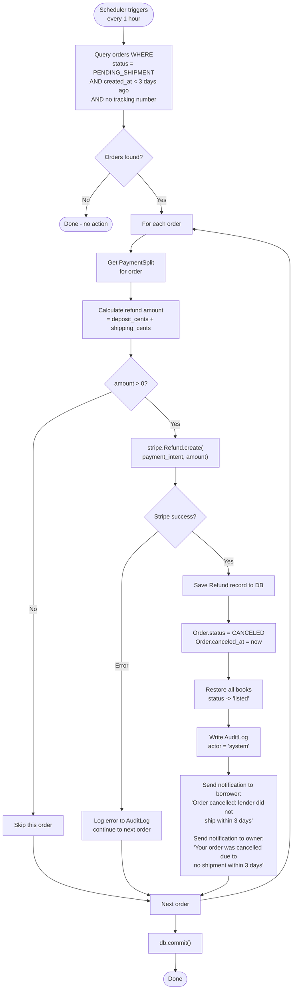
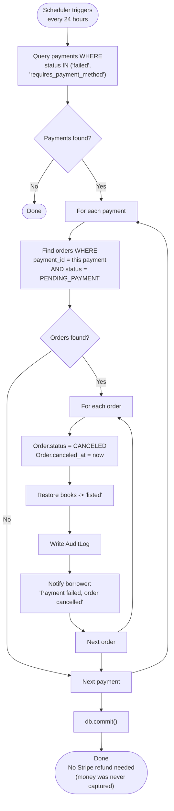
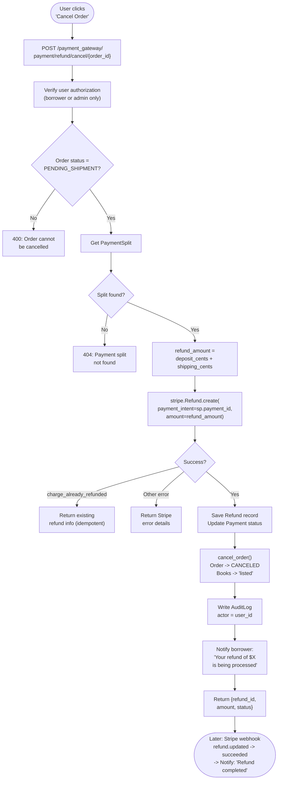
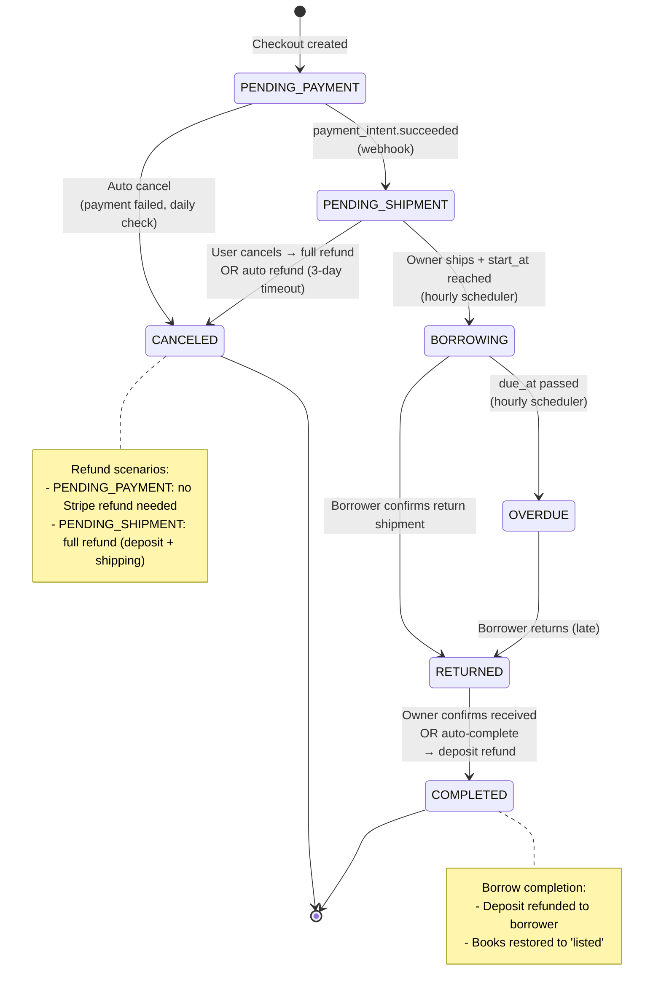
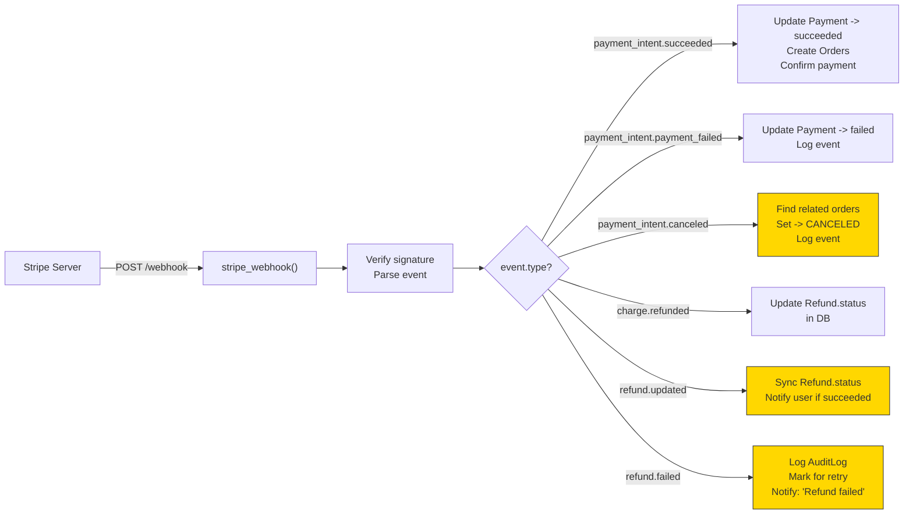
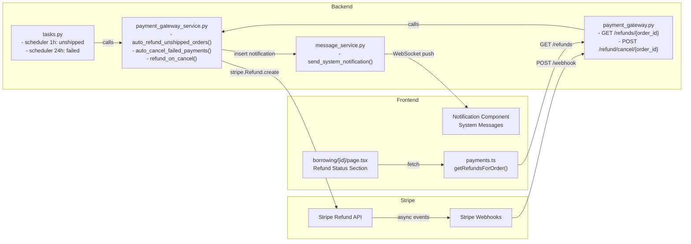

# MVP6 Automated Refund Handling - Flow Diagrams

## 1. Overall Refund System Architecture

```mermaid
flowchart TB
    subgraph Triggers["Refund Trigger Sources"]
        T1["Scheduler: Every 1h<br/>auto_refund_unshipped_orders"]
        T2["Scheduler: Every 24h<br/>auto_cancel_failed_payments"]
        T3["User Action<br/>POST /refund/cancel/{order_id}"]
        T4["Stripe Webhook<br/>payment_intent.canceled"]
        T5["Order Completed<br/>refund_deposit_for_order"]
    end

    subgraph Processing["Refund Processing Layer"]
        P1["Determine refund amount<br/>(deposit / shipping / full)"]
        P2["Call Stripe Refund API<br/>stripe.Refund.create()"]
        P3["Save Refund record to DB"]
        P4["Update Payment status<br/>(refunded / partially_refunded)"]
        P5["Update Order status<br/>(CANCELED / COMPLETED)"]
        P6["Restore book status<br/>to 'listed'"]
        P7["Write AuditLog"]
        P8["Send system notification<br/>to borrower/owner"]
    end

    subgraph Webhook["Stripe Webhook Callbacks"]
        W1["refund.updated<br/>Sync Refund.status in DB"]
        W2["refund.failed<br/>Log + mark for retry"]
    end

    subgraph Frontend["Frontend Display"]
        F1["Order Detail Page<br/>Refund Status Section"]
        F2["Notification Bell<br/>Refund Messages"]
    end

    T1 --> P1
    T2 --> P5
    T3 --> P1
    T4 --> P5
    T5 --> P1

    P1 --> P2
    P2 --> P3
    P3 --> P4
    P4 --> P5
    P5 --> P6
    P6 --> P7
    P7 --> P8

    P2 -.->|Stripe async callback| W1
    P2 -.->|Stripe async callback| W2

    P3 -->|GET /refunds/{order_id}| F1
    P8 -->|WebSocket + REST| F2
```

## 2. Scenario A: Auto Refund Unshipped Orders (Scheduled)



## 3. Scenario B: Auto Cancel Failed Payments (Scheduled)



## 4. Scenario C: User Cancels Order (Immediate)



## 5. Complete Order Lifecycle with Refund Points



## 6. Webhook Event Handling Flow



> Yellow nodes = NEW webhook handlers added in MVP6

## 7. Development Task Dependency

```mermaid
gantt
    title MVP6 Development Order
    dateFormat X
    axisFormat %s

    section Backend
    B1 Refund Logic (3 functions + fix sa_func)  :b1, 0, 3
    B2 Stripe API + New Endpoints                :b2, after b1, 2
    B3 Scheduler Jobs + Webhook Enhancement      :b3, after b2, 1

    section Testing
    API Testing via /docs                        :test, after b3, 1

    section Frontend
    F1 Refund Status UI                          :f1, after test, 2
    F2 Notification UI                           :f2, after test, 2
```



## 8. Data Flow Between Components


